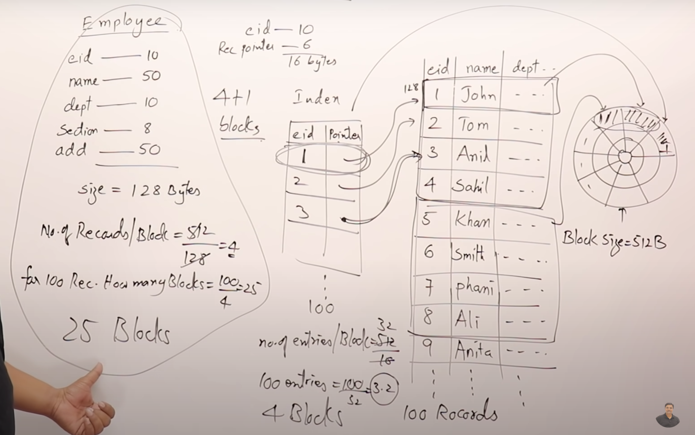
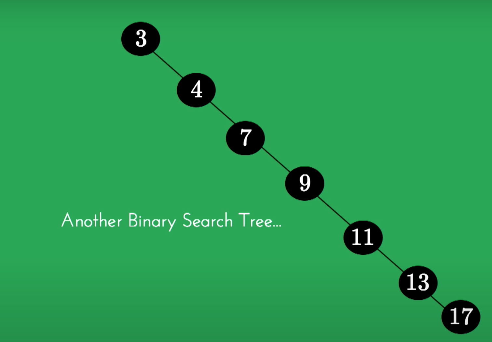
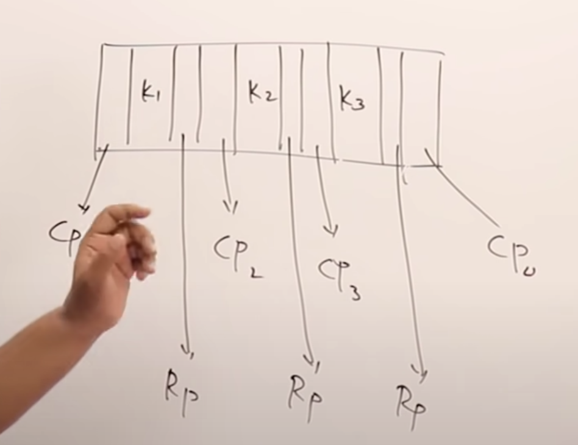
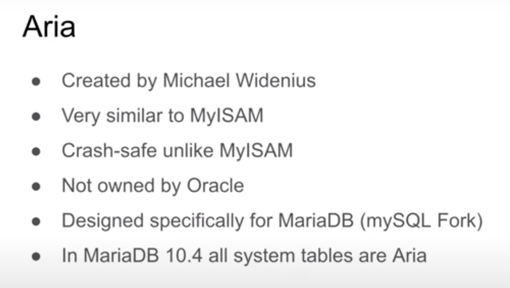

# Disk storage
## Disk structure 

- Divided into tracks and sectors
- Sectors is consist of blocks (for ex 512 bytes)
- block address = Track number, sector number
- We already read/write in terms of blocks
- Each byte in block is retrieved based on offset

- by spinning, it will change the sectors
- Arm movement of header, tracks are changed
- Data must be loaded to main memory so that program can use it
- Data structure is for program to access data from main memory
- DBMS manages disk storage 

- How many blocks are required to store data?
- How many blocks needs to be searched to access data?
- How much storage is required to store index with pointer taking 6 bytes?
- With dense index, how many blocks are required to be read?

- What if index size is also growing?
    - Add index above index
    - Each block in index, will have entry in multi index
    - This is called sparsed index
    - How many blocks are required to read data?

- Should we add multi index manually?
    - No
    - We want multi level index gets added automatically and deleted automatically
    - We want self managed multi level indexing 
    - This gives idea of B/B+ tree    
# Data Structure
# Binary search tree

- 1 key
- two children
# M-way search tree

- use 4 way search tree to store index

- How m-way creates problem?
    - skewed tree
## B Tree
- m-way search tree with some rules
- every node you must fill at least half, until don't create next level node
1.  every node must have ceil(m/2) children, split if got more and move mid to parent
2. Root can have minimum two children
3. All leaf at same level
4. creation process is bottom up

- Every node has record pointer
## B+ Tree

- Add 20
- Add 0

Visualize operation https://www.cs.usfca.edu/~galles/visualization/BPlusTree.html

- only leaf node will have pointer of record pointer
- every parent key will also be stored in leaf node
- This become dens index
- parent become sparse tree
## LSM Tree
## TSM Tree
# Database storage engine

# Reference
https://www.youtube.com/watch?v=aZjYr87r1b8
https://www.youtube.com/watch?v=K9Qd3UMHUQ4&t=2880s
https://www.youtube.com/watch?v=C_q5ccN84C8